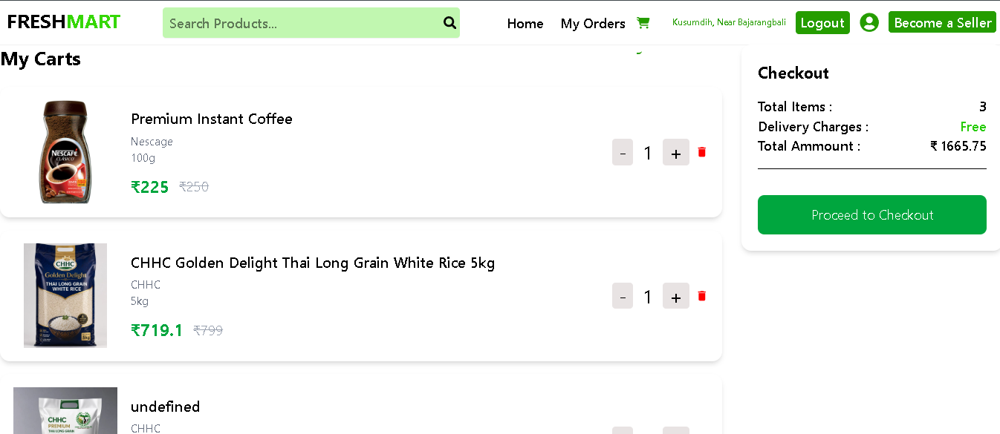
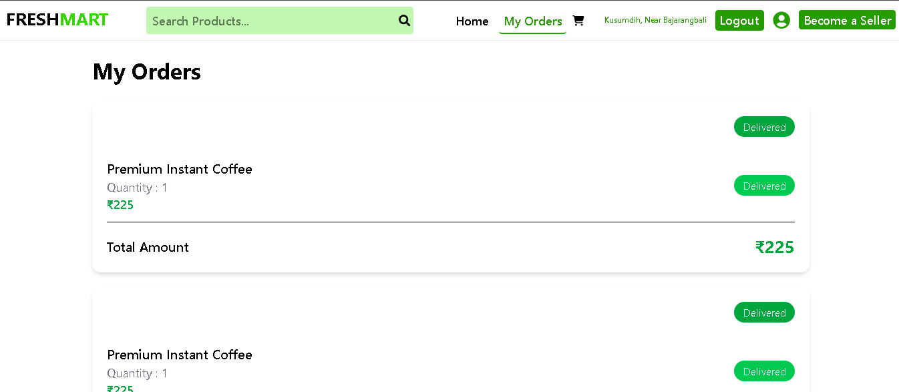
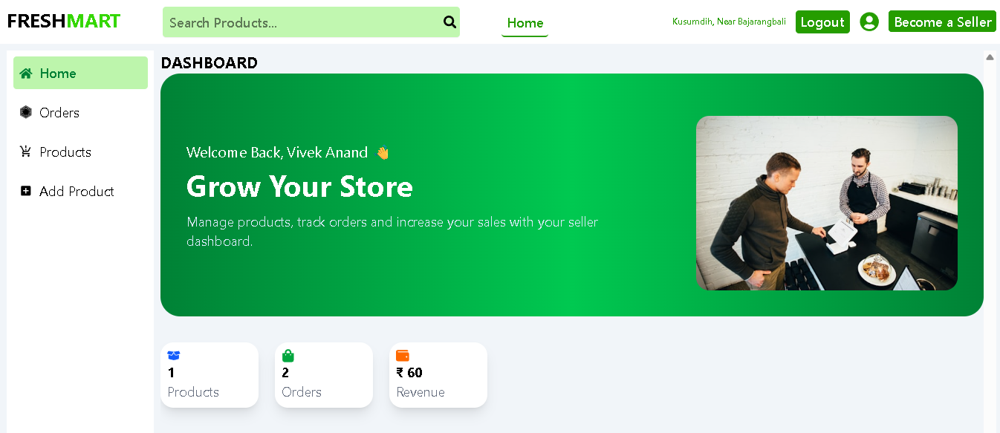
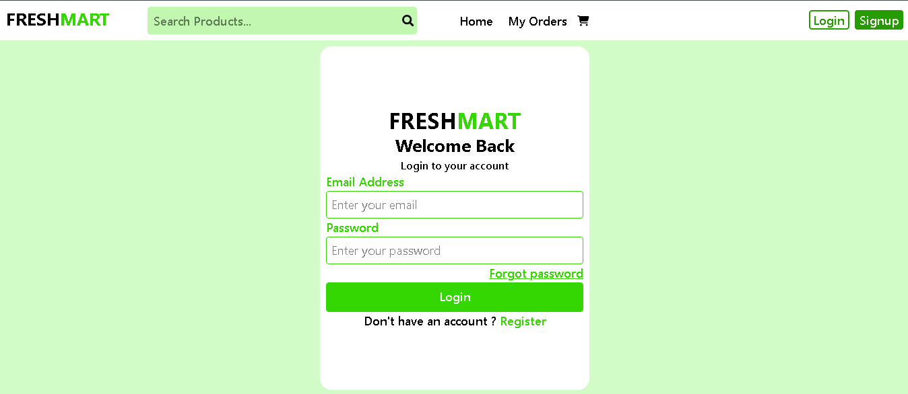

# 🛒 Grocery Store Frontend

A modern and responsive Grocery Store web application built using **React.js**. This project provides separate interfaces for customers and sellers, allowing users to browse products, manage carts, place orders, and enabling sellers to manage products and orders.

---
## Screenshots

### Home Page


### Shopping Cart


### Order


### Seller Dashboard


### Login


## 🚀 Features

### 👤 Customer

* User Registration & Login
* JWT Authentication
* Browse Products
* Search Products
* Filter Products by Category
* Product Details
* Add to Cart
* Update Cart Quantity
* Remove Items from Cart
* Place Orders
* View Order History
* User Profile

### 🛍️ Seller

* Seller Authentication
* Seller Dashboard
* Add Products
* Edit Products
* Delete Products
* View All Products
* Manage Orders
* Filter Orders by Status
* Update Order Status
* Revenue Overview

---

## 🛠️ Tech Stack

* React.js
* React Router DOM
* Axios
* Tailwind CSS
* React Icons
* Context API
* Local Storage

---

## 📂 Project Structure

```
src/
│
├── Components/
├── Pages/
├── Context/
├── Layout/
├── Assets/
├── Routes/
├── App.jsx
└── main.jsx
```

---

## ⚙️ Installation

Clone the repository

```bash
git clone <repository-url>
```

Navigate to the project directory

```bash
cd grocery-frontend
```

Install dependencies

```bash
npm install
```

Start the development server

```bash
npm run dev
```

---

## 🔗 Backend API

This frontend communicates with the Grocery Store Backend using REST APIs.

Example Base URL:

```
https://grocery-kirana-store.onrender.com
```

---

## 📸 Main Modules

* Home
* Login
* Register
* Product Listing
* Product Details
* Shopping Cart
* Checkout
* Customer Orders
* Seller Dashboard
* Product Management
* Order Management
* Profile

---

## 🔐 Authentication

* JWT Token Authentication
* Protected Routes
* Role-Based Access (Customer & Seller)

---

## 🎨 UI Features

* Responsive Design
* Mobile Friendly
* Clean Dashboard
* Interactive Cards
* Status Badges
* Product Search
* Loading States
* Toast/Alert Notifications

---

## 📈 Future Improvements

* Wishlist
* Online Payments
* Product Reviews & Ratings
* Coupon System
* Email Notifications
* Dark Mode
* Analytics Dashboard
* Real-Time Order Tracking

---

## 👨‍💻 Developer

**Vivek Anand**

Frontend Developer | React.js | JavaScript | Tailwind CSS | FastAPI | MongoDB

---

## 📄 License

This project is developed for learning, portfolio, and educational purposes.
